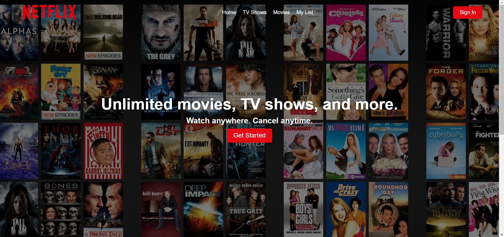
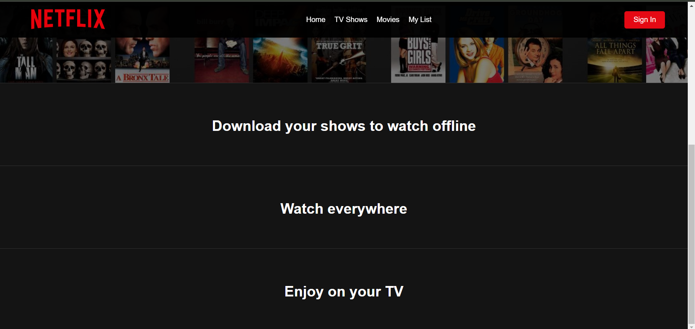

# Netflix Landing Page Clone

A responsive clone of Netflix's landing page created to practice and showcase front-end development skills using HTML, CSS, and JavaScript. This project emulates the look and feel of the original Netflix landing page, focusing on design and user experience.

## Project Demo




## Features

- **Responsive Design**: Adapts to different screen sizes (mobile, tablet, desktop).
- **Smooth Animations**: Subtle hover effects and animations to enhance the user experience.
- **Reusable Components**: Styled sections and elements similar to the Netflix UI.
- **Modular CSS**: Organized styling for easy maintenance and updates.

## Tech Stack

- **HTML**: Structure of the page.
- **CSS**: Styling and responsive design.
- **JavaScript**: Basic interactivity.

## Getting Started

### Prerequisites
- Web browser (Chrome, Firefox, Safari, etc.)
- Git (optional, for cloning the repository)

### Installation

1. Clone the repository:
   ```bash
   git clone https://github.com/SujalAgrawal08/Netflix-Landing-Page-Replica.git
2. Open the project folder:
   ```bash
   cd netflix-landing-page-clone
3. Run the index.html file in your preferred browser to view the project.

### Usage
Simply open index.html in a browser to view the landing page. The page includes a top navigation bar, showcase content, and sections similar to the original Netflix landing page.

### Acknowledgments
- Inspired by Netflix's official landing page design.
- Created to enhance front-end development skills in HTML, CSS, and JavaScript.
